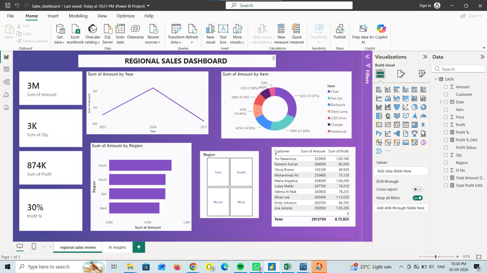

# Regional Sales - DA+BA Project 
Owner: lavanyagowdaa-hub

## Business Problem
South region drives 38% sales but profit inconsistent. Where should business invest inventory?

## KPIs (Validated: 29,12,750)
- Total Sales: 29,12,750
- Total Profit: 8,73,825
- Profit %: 30%
- Top Region: South (38%)
- Top Product: Chair (31.6% sales)

## SQL - 12 Queries (Basic + Advanced)
**BA Level:** Region Performance, Product Performance, Profit Status breakdown
**DA Level:** 
- Q5: RANK() OVER(PARTITION BY Region ORDER BY SUM(Amount) DESC) - Top 3 Customers
- Q6: SUM() OVER(PARTITION BY Region ORDER BY Date) - Running Total
- Q7: CASE WHEN for margin strategy
- Q8: SUM(CASE WHEN Item='Chair' THEN Amount ELSE 0 END) - Pivot
- Q11: LAG() for MoM growth

## Power BI
KPI Dashboard with DAX measures - Total Sales, Profit %, Region wise, Item wise

## Recommendation
Focus inventory on Chair & Pen Set in South (38% revenue driver). Review low-margin pricing in West.

## Tech Stack
MySQL Workbench | Power BI | Excel | GitHub

GitHub: https://github.com/lavanyagowdaa-hub/regional-sales-DA-BA-project
